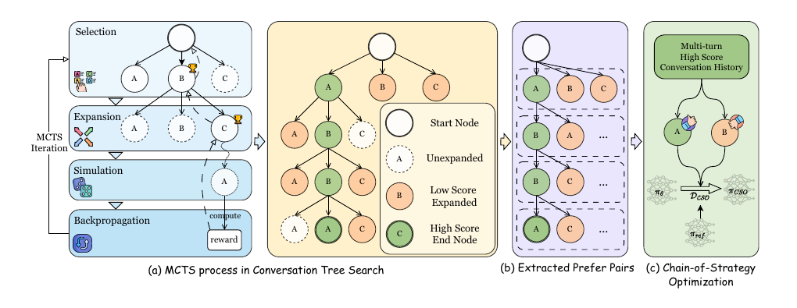

# ED-未提及-2025-Chain_of_Strategy_Optimization_Makes_Large_Language_Models_Better Emotional Supporter

*论文下载地址（可选）：[https://arxiv.org/abs/2503.05362](https://arxiv.org/abs/2503.05362)*

*代码是否开源：是 [https://github.com/XingYuSSS/CSO](https://github.com/XingYuSSS/CSO)*

*分享人：马明晖*

## 一句话总结挑战
> 情感支持对话要求模型在每一轮中结合上下文精准选择支持策略，并随用户情绪变化灵活调整，避免策略偏置。

## 一句话总结创新贡献
> 本文提出基于MCTS构建的转轮级偏好数据集ESC-Pro及Chain-of-Strategy Optimization（CSO）框架，通过偏好学习提升情感支持对话中的策略选择能力与适应性。

## 举一个例子说明这篇文章的创新点
> 作者先用蒙特卡洛树搜索从种子情感支持对话扩展出策略树，再从高分路径与低分兄弟节点中抽取偏好对，构建turn-level训练数据用于策略优化。

## 框架图

**框架工作流描述**：
> 首先以ESC种子对话为起点，借助MCTS在每轮展开不同支持策略，并由奖励模型从共情、信息、拟人度和策略四个维度评分；随后从搜索树中筛选高质量路径与低分对照节点，构造ESC-Pro偏好对；最后在该数据上进行链式策略偏好优化，使模型逐轮学会更合适的策略选择并缓解偏好偏置。

## 本文挑战及已有工作不足
> 1. 情感支持对话需要在细粒度轮次上做策略决策，问题本身具有强时序性和动态性
> 2. 仅用监督微调学习单一金标准回复，无法显式建模不同策略之间的优劣权衡
> 3. 大模型容易在策略选择上形成固定偏好，难以随用户情绪和语境变化及时调整

## 印象最深刻的点
> 1. CSO不仅提升了策略选择效果，还显著缓解了策略偏置，说明偏好优化比普通SFT更适合该任务
> 2. 奖励设计同时覆盖共情、信息、拟人度和策略四个维度，更贴近情感支持任务目标
> 3. 用MCTS系统探索对话中的策略路径，生成了高质量的转轮级偏好数据，而不是依赖单一人工答案
> 4. 方法在LLaMA-3.1-8B、Qwen2.5-7B和Gemma-2-9B上都表现稳定，并且对LoRA和全参数微调均有效

## 对我们的启发
> 1. 把情感支持建模为逐轮策略决策，而不是整段对话的一次性生成
> 2. 通过高分路径和低分兄弟节点构造精细偏好对，刻画策略间的相对优劣
> 3. 将多步搜索与偏好学习结合，用搜索过程自动生成训练信号

## Idea是否好想
> 本文的核心思路是把情感支持对话中的策略选择转化为可搜索、可比较、可优化的turn-level偏好学习问题。MCTS负责探索策略空间并找到更优轨迹，ESC-Pro负责把搜索结果组织成可训练的偏好对，CSO则利用这些偏好对逐轮优化模型，使其在上下文变化中学会更细致的策略权衡。方法重点不在延长回复，而在提升支持策略的时机选择与偏好校准。

## 是否有开创性
> 新颖性主要体现在两点：一是用MCTS构造情感支持对话的转轮级偏好数据集；二是提出链式策略优化，让偏好学习直接作用于每一轮策略选择，而不是只对整体回复进行对齐。

## 是否属于热点
> 情感支持对话、偏好优化、MCTS、策略选择、转轮级学习、LLM对齐

## 其他需要补充的点（可选）
> 1. 作者进一步验证了IPO、KTO、SimPO、ORPO等偏好优化方法也能从ESC-Pro中获益
> 2. 实验不仅包含自动指标，还包括人工评估，在Acceptance、Effectiveness和Sensitivity上均优于SFT
> 3. 作者从ExTES中选取100个种子对话扩展到423个对话，总utterance数从1,613增至14,383

## 与其他论文的关联（可选）
> 1. 与传统SFT相比，本文强调策略优劣的相对偏好，而非单一金标准回复拟合
> 2. 与已有ESC工作相比，本文将重点从共情回复生成扩展到逐轮策略选择与偏好偏置控制
> 3. 与MCTS相关，但这里的搜索目标不是游戏获胜，而是构造高质量支持策略轨迹和偏好数据

## 还有哪些不足的地方（未来工作）
> 1. 结合human-in-the-loop机制提升数据多样性与质量
> 2. 扩大种子数据规模，构建更丰富的ESC偏好数据
> 3. 进一步加强个性化建模，使情感支持更贴近不同用户需求
> 4. 探索更大规模模型上的可扩展性，例如70B以上参数模型
