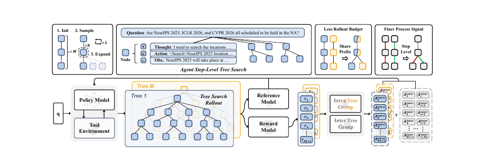

# PD-ICLR-2026-TreeSearch for LLM Agent Reinforcement Learning

*论文下载地址（可选）：[https://arxiv.org/abs/2509.21240](https://arxiv.org/abs/2509.21240)*

*代码是否开源：是 [https://github.com/AMAP-ML/Tree-GRPO](https://github.com/AMAP-ML/Tree-GRPO)*

*分享人：马明晖*

## 一句话总结挑战
> 文章要解决的是：如何在长时序、多轮交互的LLM Agent强化学习中，缓解仅靠结果奖励带来的监督稀疏与采样成本过高问题。

## 一句话总结创新贡献
> 文章提出Tree-GRPO，将完整Agent步骤作为树节点并在树内外估计组相对优势，从而在有限预算下获得更多rollout和更细粒度的过程监督。

## 举一个例子说明这篇文章的创新点
> 把一次完整的Thought-Action-Observation步骤作为树节点，而不是token或句子，从共享前缀的树结构中复用采样并生成步级偏好信号。

## 框架图

**框架工作流描述**：
> 先用多个独立链式轨迹初始化树，再随机挑选中间节点扩展；随后基于同树与跨树的回报分布计算组相对优势，并把分支差异转化为过程级监督信号用于训练。

## 本文挑战及已有工作不足
> 1. 现有方法主要依赖结果奖励，对中间步骤的监督稀疏，难以准确归因
> 2. 树内分支过少时，单树基线估计方差较大，训练容易不稳定
> 3. 链式独立采样存在大量前缀重复，在固定预算下样本利用率较低
> 4. 多轮Agent任务轨迹很长，rollout需要消耗大量token和工具调用预算

## 印象最深刻的点
> 1. 方法在11个数据集、3类QA任务上整体稳定优于链式RL基线
> 2. 论文给出了树内GRPO与步级DPO在梯度结构上的等价性分析
> 3. 在相同token和tool-call预算下，树搜索可获得约1.5倍的rollout数量
> 4. 在Qwen2.5-3b上，Tree-GRPO在多跳QA中显著优于链式GRPO，且仅用四分之一预算也能取得更好结果

## 对我们的启发
> 1. ReAct多轮Thought-Action-Observation框架
> 2. GRPO的组相对优势估计思路
> 3. MCTS的树搜索与分支复用思想
> 4. DPO式偏好学习对中间决策的监督启发

## Idea是否好想
> 核心思路是把按整条轨迹打分的稀疏结果奖励，借助树结构转化为分支之间的相对偏好信号；共享前缀提升采样效率，而树内与树间两级优势估计兼顾了细粒度监督和训练稳定性。

## 是否有开创性
> 创新点在于将树搜索引入在线LLM Agent RL，并以完整Agent步骤作为树节点单位，同时构建树内和树间的组相对优势，实现无需额外标注的步级过程监督。

## 是否属于热点
> LLM Agent强化学习、树搜索、过程监督、稀疏奖励信用分配

## 其他需要补充的点（可选）
> 1. 实验覆盖单跳QA、多跳QA和Web-Agent QA三类任务
> 2. 默认检索工具为搜索引擎，训练中同时强调token与tool-call双重预算约束

## 与其他论文的关联（可选）
> 1. 与ReAct框架兼容，适用于多轮Thought-Action-Observation Agent
> 2. 与DPO相比，树内优势估计可视为隐式的步级偏好优化
> 3. 与GRPO相比，Tree-GRPO用树搜索替代链式独立采样

## 还有哪些不足的地方（未来工作）
> 未提及
