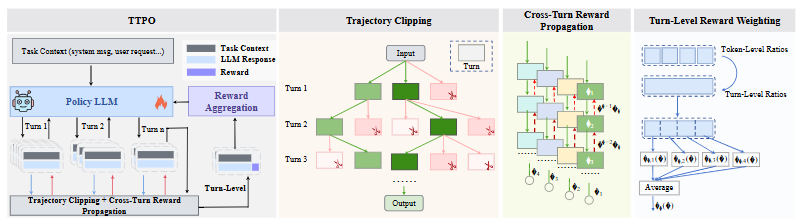

# Planing-ICLR-2026-TURN-LEVEL TRAJECTORY OPTIMIZATION FOR ROBUST MULTI-TURN LLM REASONING

*论文下载地址（可选）：未提及*

*代码是否开源：未提及*

*分享人：马明晖*

## 一句话总结挑战
> 如何让大模型在多轮对话推理中保持跨轮一致性，并避免长链路中的推理漂移与训练不稳定。

## 一句话总结创新贡献
> 提出TTPO，将轮次作为优化基本单位，并结合轮级裁剪、轨迹裁剪和奖励反向传播，提升多轮推理训练的稳定性与效果。

## 举一个例子说明这篇文章的创新点
> 将每一轮对话视为统一动作，而非逐token更新，从而对整条多轮轨迹进行更稳健的策略优化。

## 框架图

**框架工作流描述**：
> 先按轮次构建多轮轨迹，再对策略比率进行轮级裁剪；随后剪除低奖励或异常分支以抑制分叉膨胀；最后将终局奖励按折扣向前传播，为早期轮次提供更密集的学习信号。

## 本文挑战及已有工作不足
> 1. 现有RLVR、GRPO等方法主要面向单轮场景，难以直接适配多轮长程优化
> 2. 长对话中的奖励往往稀疏且延迟，信用分配困难，优化方差也更大
> 3. 多轮对话需要跨轮保持上下文一致性，推理容易随新线索引入而漂移
> 4. 逐token更新对局部噪声和异常分支较敏感，少数轨迹可能放大梯度波动

## 印象最深刻的点
> 1. 实验显示该方法在提升平均性能的同时，能显著降低运行间波动，并兼顾高分位表现
> 2. 消融和机制分析表明，轨迹裁剪与奖励反向传播是稳定性提升的关键来源
> 3. 提出无需critic的多轮RLVR框架TTPO，面向长程对话推理优化
> 4. 在六类多轮任务上验证了方法有效性，覆盖Code、Database、Math、Actions、Data-to-Text和Summarization

## 对我们的启发
> 1. 通过轨迹裁剪控制长链路中的异常分支扩张
> 2. 利用终局奖励反向传播改善多轮任务中的信用分配
> 3. 将对话轮次视为优化的基本单位，而不是仅依赖token级更新

## Idea是否好想
> 本文的核心思路是把多轮对话推理重新抽象为以轮次为单位的长程决策问题，再用更适合轨迹级优化的RL方法处理稀疏奖励和信用分配。相比单轮或token级策略更新，这种建模方式更贴合多轮交互结构，也更有利于抑制长对话中的训练噪声与分叉失控。

## 是否有开创性
> 将GRPO扩展到轮级轨迹优化，并把轮级策略裁剪、轨迹裁剪和奖励反向传播组合成一个面向多轮推理稳定性的统一框架。

## 是否属于热点
> 多轮推理、长程信用分配、RLVR、轨迹级优化、LLM对齐与稳定训练。

## 其他需要补充的点（可选）
> 1. 实验结果表明该方法兼顾平均性能和高分位性能
> 2. 机制分析显示，轮级建模有助于稳定优化过程
> 3. 作者强调该方法是面向多轮对话推理的通用稳定化方案

## 与其他论文的关联（可选）
> 1. 与RLVR相关，使用可验证奖励进行优化
> 2. 与GRPO相关，可视为其面向多轮场景的扩展
> 3. 与PPO式裁剪目标相关，但粒度从token级转为轮级

## 还有哪些不足的地方（未来工作）
> 1. 未提及具体未来工作方向
> 2. 未提及进一步扩展或应用计划
